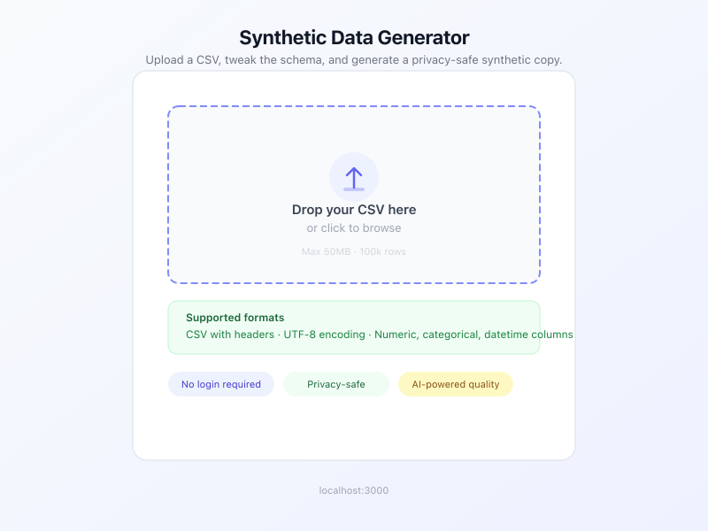
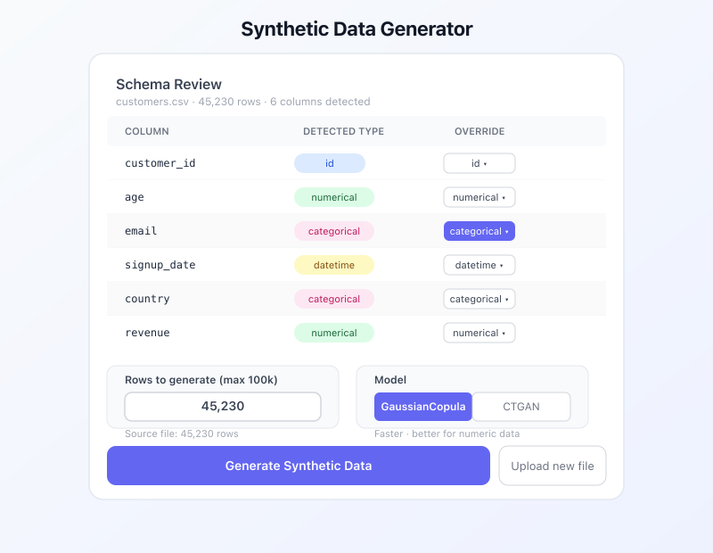
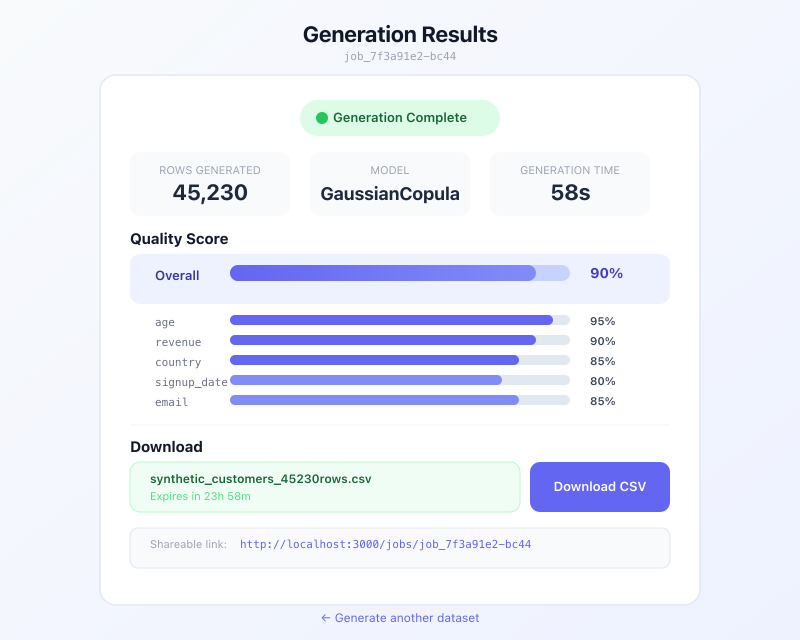
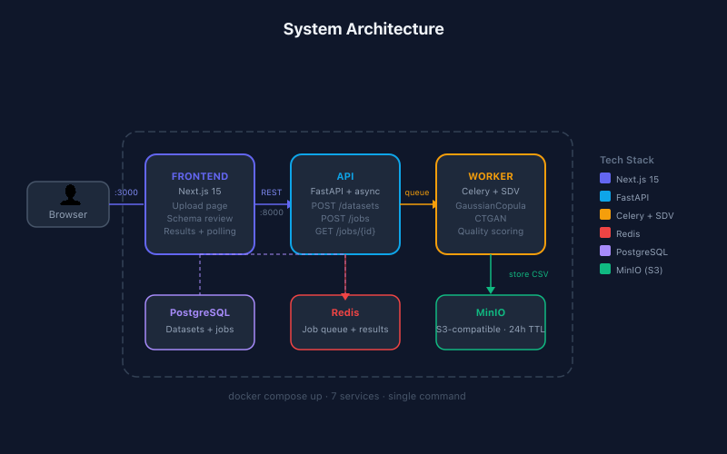

# Synthetic Data Generator

Developer-first synthetic data platform. Upload a CSV (or connect a database), generate privacy-safe synthetic data with statistical fidelity, and download results — free tier available, Pro and Enterprise tiers for power users.

---

## Screenshots

### 1. Upload
Drop any CSV (≤ 50 MB, 100k rows) — or load a built-in sample template.



### 2. Schema Review
Auto-inferred column types with PII detection. Override any column before generating.



### 3. Results & Quality Score
Async results page with live polling. Overall quality score + per-column breakdown. Shareable URL, 24-hour download TTL.



### 4. Dashboard
Dataset history, usage tracking, and one-click re-generation. Free-tier usage meter with Pro upgrade prompt.


### 5. Architecture
7-service Docker Compose stack — single command to run everything locally.



---

## Quick Start

```bash
# 1. Clone
git clone https://github.com/SauNu84/data-generator.git
cd data-generator

# 2. Copy env and start all services
cp .env.example .env
docker compose up --build

# 3. Open the app
open http://localhost:3000
```

Register a free account to get started. No credit card required.

**Free tier:** 10 generations/month, CSV upload, all models.
**Pro ($49/mo):** Unlimited generations, API access, dataset history, PII masking, dbt integration.
**Enterprise (custom):** Multi-table synthesis, DB connectors, SSO, SOC2.

**Services started by Docker Compose:**

| Service    | Port | Description                         |
|------------|------|-------------------------------------|
| frontend   | 3000 | Next.js UI                          |
| api        | 8000 | FastAPI REST backend                |
| worker     | —    | Celery generation worker (SDV)      |
| postgres   | 5432 | Job + dataset metadata              |
| redis      | 6379 | Job queue + result backend          |
| minio      | 9000 | S3-compatible file storage          |
| minio-init | —    | One-shot bucket initialiser         |

---

## How It Works

```
Register / Log in (email or Google)
      ↓
Upload CSV (≤50MB)  ─OR─  Load a sample template  ─OR─  Connect a database (Enterprise)
      ↓                                                       ─OR─  Parse dbt schema.yml (Pro)
PII auto-detection (emails, SSNs, credit cards, names, phone numbers)
      ↓
Schema review — per-column type overrides
      ↓
Celery job enqueued → SDV fits the model (GaussianCopula / CTGAN / HMA multi-table)
      ↓
Quality score computed (statistical fidelity per column)
      ↓
Synthetic CSV stored in MinIO / S3 (24h TTL)
      ↓
Download via presigned URL  ─OR─  Access via API key (Pro)
```

### Models

| Model | Speed | Best For | Tier |
|-------|-------|----------|------|
| **GaussianCopula** (default) | Fast (~58s @ 100k rows) | Numeric-heavy datasets | Free+ |
| **CTGAN** | Slower | Categorical-heavy datasets | Free+ |
| **HMA** (Hierarchical) | Varies | Multi-table with FK relationships | Enterprise |

---

## API Reference

Pro users can access the full API with an API key from the dashboard.

```bash
# Create an API key at http://localhost:3000/dashboard → Settings

# 1. Upload CSV
curl -X POST http://localhost:8000/api/upload \
  -H "X-API-Key: sdg_live_your_key_here" \
  -F "file=@your_data.csv"
# → { "dataset_id": "...", "columns": [...], "row_count": N, "pii_columns": [...] }

# 2. Enqueue generation
curl -X POST http://localhost:8000/api/generate \
  -H "X-API-Key: sdg_live_your_key_here" \
  -H "Content-Type: application/json" \
  -d '{"dataset_id": "...", "row_count": 1000, "model": "GaussianCopula"}'
# → { "job_id": "..." }

# 3. Poll status
curl http://localhost:8000/api/jobs/{job_id} \
  -H "X-API-Key: sdg_live_your_key_here"
# → { "status": "done", "quality_score": 0.90, "download_url": "..." }

# 4. Download
curl -L "{download_url}" -o synthetic.csv

# dbt integration (Pro) — generate from schema.yml directly
curl -X POST http://localhost:8000/api/dbt/generate \
  -H "X-API-Key: sdg_live_your_key_here" \
  -H "Content-Type: application/json" \
  -d '{"schema_yaml": "<contents of schema.yml>", "model": "orders", "row_count": 5000}'
```

Full OpenAPI docs: [http://localhost:8000/docs](http://localhost:8000/docs)

---

## Development

### Prerequisites
- Docker Desktop ≥ 4.x
- (Optional for frontend dev) Node.js 20+

### Backend only (no Docker)

```bash
pip install -r requirements.txt

# Requires local Postgres, Redis, MinIO — use docker compose for those:
docker compose up postgres redis minio minio-init -d

cp .env.dev .env
alembic upgrade head
uvicorn app.main:app --reload
```

### Frontend only

```bash
cd frontend
npm install
NEXT_PUBLIC_API_URL=http://localhost:8000 npm run dev
```

### Run tests

```bash
# Backend
pytest

# Frontend
cd frontend && npm test
```

### Run tests

```bash
# Backend (unit + integration)
pytest

# Frontend
cd frontend && npm test

# E2E (Playwright — requires full stack running)
npx playwright test tests/e2e/auth/
```

### Environment variables (Phase 2)

Copy `.env.example` and set:

```bash
# Auth
SECRET_KEY=your-256-bit-secret
GOOGLE_CLIENT_ID=...
GOOGLE_CLIENT_SECRET=...

# Stripe
STRIPE_SECRET_KEY=sk_test_...
STRIPE_WEBHOOK_SECRET=whsec_...
STRIPE_PRO_PRICE_ID=price_...

# Email (optional in dev — set TEST_SKIP_EMAIL_VERIFY=1 to skip)
SMTP_HOST=...
SMTP_PORT=587
SMTP_USER=...
SMTP_PASSWORD=...
```

### CI

GitHub Actions workflow runs on every push to `main` and on all pull requests:

| Job | What it checks |
|-----|----------------|
| `backend-test` | pytest, Alembic migrations, coverage ≥ 80% |
| `frontend-test` | Jest, TypeScript, `next build` |
| `e2e-test` | Playwright auth flows (register/login/logout/dashboard) |
| `stripe-webhook-test` | Stripe webhook lifecycle against `stripe/stripe-mock` |
| `docker-build` | Backend + frontend Docker image builds |

---

## Tech Stack

| Layer | Technology |
|-------|-----------|
| Frontend | Next.js 14, TypeScript, Tailwind CSS |
| Backend | FastAPI, SQLAlchemy (async), Alembic |
| Generation | SDV 1.35.1 (GaussianCopula, CTGAN, HMA) |
| Queue | Celery 5 + Redis |
| Storage | MinIO (dev) / S3 (prod) |
| Database | PostgreSQL 16 |
| Auth | JWT + bcrypt, Google OAuth 2.0 |
| Billing | Stripe (Checkout, Webhooks) |
| PII masking | Faker |
| Testing | pytest, Jest, Playwright |
| Infra | Docker Compose, GitHub Actions CI |

---

## Project Structure

```
data-generator/
├── app/                      # FastAPI backend
│   ├── main.py               # App factory, route registration, middleware
│   ├── auth.py               # JWT encode/decode, bcrypt, refresh token helpers
│   ├── deps.py               # FastAPI dependencies (get_current_user, require_tier)
│   ├── pii.py                # PII detection + Faker-based masking
│   ├── dbt_parser.py         # dbt schema.yml → SDV Metadata mapper
│   ├── tasks.py              # Celery: single-table + multi-table generation
│   ├── models.py             # SQLAlchemy: User, ApiKey, Dataset, GenerationJob, ...
│   ├── schemas.py            # Pydantic request/response models
│   ├── storage.py            # MinIO/S3 helpers (upload, presigned URL)
│   ├── config.py             # Settings (env-based, Pydantic BaseSettings)
│   └── routes/               # Route modules
│       ├── auth.py           # /auth/* (register, login, refresh, logout, OAuth)
│       ├── billing.py        # /api/billing/*, /api/webhooks/stripe
│       ├── keys.py           # /api/keys (API key CRUD)
│       ├── dashboard.py      # /api/dashboard (dataset history)
│       ├── dbt.py            # /api/dbt/parse, /api/dbt/generate
│       ├── samples.py        # /api/samples (built-in templates)
│       ├── multi_table.py    # /api/upload/multi-table, /api/multi-table/*/generate
│       └── database.py       # /api/connect/database (DB connector, Enterprise)
├── frontend/                 # Next.js application
│   ├── app/page.tsx          # Upload + schema review (PII badge)
│   ├── app/login/page.tsx    # Login (email/password + Google)
│   ├── app/register/page.tsx # Registration
│   ├── app/dashboard/page.tsx# Dataset history, usage, upgrade prompt
│   ├── app/jobs/[job_id]/    # Results + quality score
│   ├── app/auth/callback/    # Google OAuth callback handler
│   └── lib/                  # api.ts, auth.ts, analytics.ts
├── alembic/                  # Database migrations (001: initial, 002: M1 auth/billing)
├── tests/                    # Pytest unit + integration tests
├── tests/e2e/auth/           # Playwright E2E tests (auth flows)
├── plans/                    # ADRs + architecture diagrams
├── docs/screenshots/         # UI screenshots
├── docker-compose.yml        # Full-stack local dev (7 services)
├── Dockerfile                # API + worker image
└── CHANGELOG.md              # Version history
```

---

## Roadmap

See [CHANGELOG.md](CHANGELOG.md) for full version history.

**Phase 2 shipped (v0.2.0):**
- ✅ User auth (email/password + Google OAuth), JWT sessions
- ✅ API key management (Pro tier)
- ✅ Stripe billing (Free / Pro / Enterprise tiers)
- ✅ Dataset history dashboard with usage tracking
- ✅ PII auto-detection + Faker masking
- ✅ dbt schema.yml integration (Pro)
- ✅ Sample dataset templates (e-commerce, HR, fintech, healthcare)
- ✅ Multi-table synthesis with FK preservation (Enterprise)
- ✅ Database connector — PostgreSQL / MySQL (Enterprise)

**Phase 3 (planned):**
- AI Agent mode — describe your data in natural language → schema generation
- WebSocket live generation progress
- Email notifications on job completion
- SOC 2 Type II compliance preparation
- SSO / SAML (Enterprise)

---

## License

MIT
