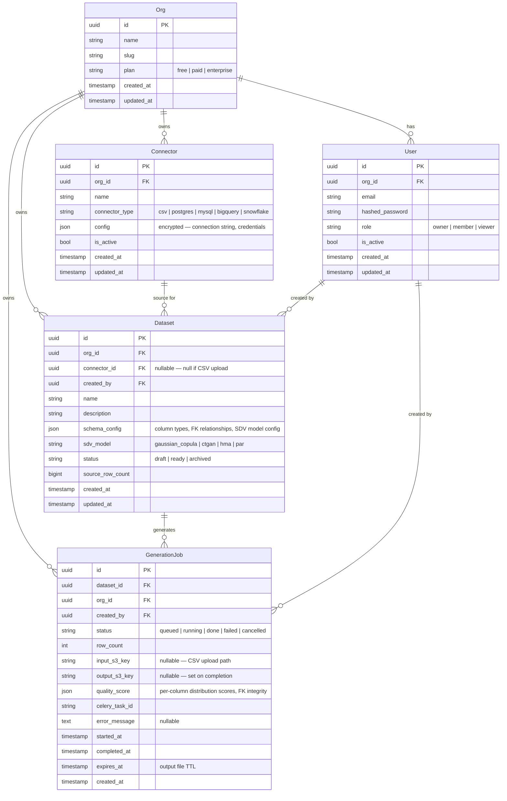
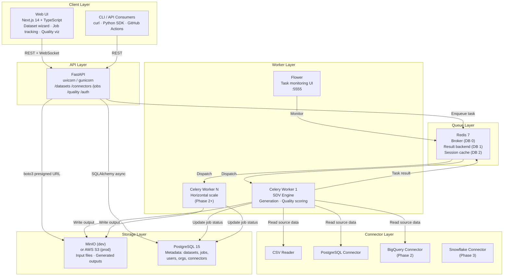
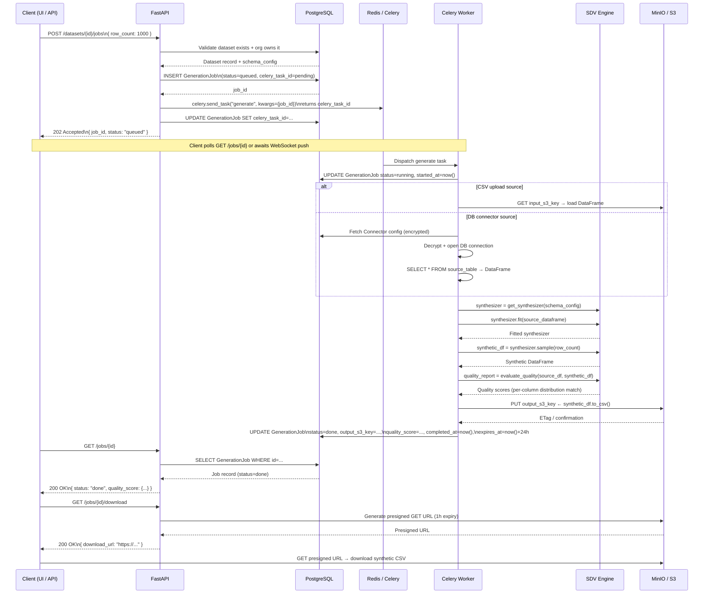
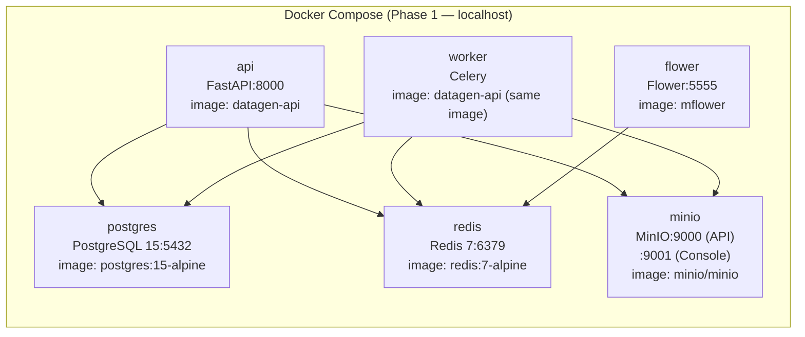

# Architecture Diagrams — Synthetic Data Generator

- **Date**: 2026-04-01
- **Author**: Enterprise Architect
- **Issue**: SAU-97 (parent: SAU-96)

---

## ERD — Core Data Model

---

## Component Diagram — Services and Connections

---

## Sequence Diagram — Async Generation Flow

---

## Phase 1 Docker Compose Topology

