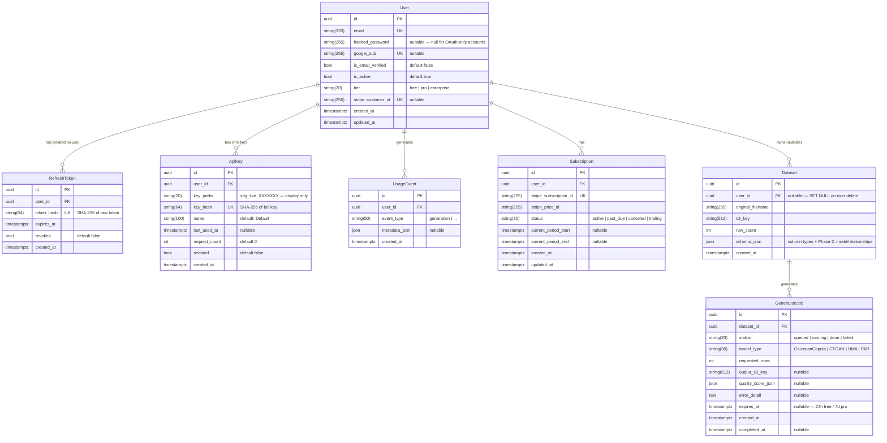

# DB Schema — Phase 2 (Auth, Billing, API Keys)

- **Date**: 2026-04-02
- **Author**: Enterprise Architect
- **Issue**: SAU-106 (parent: SAU-105)
- **Migration**: `alembic/versions/20260402_0001_002_m1_auth_billing.py` (revision 002)

---

## Full ERD — Phase 1 + Phase 2 Tables



---

## Table Descriptions

### `users`
Central identity table. Supports email/password and Google OAuth on the same row.
- `hashed_password`: null for OAuth-only accounts; bcrypt hash otherwise.
- `google_sub`: Google's stable user identifier (persists across email changes).
- `tier`: drives feature gating throughout the application (`free` | `pro` | `enterprise`).
- `stripe_customer_id`: set on first Pro upgrade; used to correlate Stripe webhooks.

### `refresh_tokens`
Server-side refresh token registry. Only the SHA-256 hash is stored — the raw token is never persisted.
- Rotation on use: old record is revoked, new record is created atomically.
- `expires_at`: 7-day TTL; expired records are safe to prune.
- Clean-up: Celery periodic task should DELETE WHERE revoked=true OR expires_at < now() weekly.

### `api_keys`
Programmatic access keys for Pro/Enterprise users.
- `key_prefix`: first 16 characters of the raw key (`sdg_live_XXXXXXX`); stored plaintext for display in the dashboard — never the full key.
- `key_hash`: SHA-256 of the full key; used for lookup on every API request.
- `request_count` + `last_used_at`: updated on each authenticated request (hot write path; acceptable at Phase 2 scale).

### `usage_events`
Append-only event log for rate limiting and billing.
- One row per generation (event_type = "generation").
- `metadata_json`: optional context (model_type, row_count, dataset_id) — not required for M1.
- Used by: free tier monthly generation limit check, billing usage summary endpoint.

### `subscriptions`
Mirrors the Stripe subscription lifecycle.
- Driven entirely by Stripe webhooks — never mutated directly by application code.
- State machine: `trialing → active → past_due → canceled` (see ADR-006).
- When `status` ∈ {canceled, unpaid, past_due} and no other active subscriptions: `users.tier` → `free`.

### `datasets`
Source data registry. Phase 2 adds `user_id` FK (added in migration 002).
- `schema_json` is polymorphic: Phase 1 stores column schema; Phase 2 extends with `mode` + `relationships` for multi-table and dbt datasets (backward-compatible JSON extension, no column change needed).

### `generation_jobs`
Async job lifecycle tracking.
- `model_type`: `HMA` used for multi-table jobs.
- `output_s3_key`: set on completion; presigned URL generated on demand.
- `expires_at`: free tier = now()+24h, pro = now()+7d.

---

## Index Strategy

| Table | Index | Type | Purpose |
|-------|-------|------|---------|
| users | email | UNIQUE | login lookup |
| users | google_sub | UNIQUE | OAuth lookup |
| users | stripe_customer_id | UNIQUE | webhook correlation |
| refresh_tokens | user_id | BTREE | cascade lookup |
| refresh_tokens | token_hash | UNIQUE | token validation |
| api_keys | user_id | BTREE | key listing |
| api_keys | key_hash | UNIQUE | key validation (hot path) |
| usage_events | user_id | BTREE | monthly count query |
| usage_events | event_type | BTREE | event filtering |
| subscriptions | user_id | BTREE | user subscription lookup |
| subscriptions | stripe_subscription_id | UNIQUE | webhook idempotency |
| datasets | user_id | BTREE | user dataset listing |

---

## Migration Sequence

### Migration 001 — Initial Schema (Phase 1)
**File**: `20260402_0000_001_initial_schema.py`

Creates:
- `datasets` — source CSV registry
- `generation_jobs` — async job tracking

### Migration 002 — M1 Auth & Billing (Phase 2, M1)
**File**: `20260402_0001_002_m1_auth_billing.py`

**Expand phase** (additive — zero-downtime, safe to run while old code is live):
- CREATE TABLE `users`
- CREATE TABLE `refresh_tokens`
- CREATE TABLE `api_keys`
- CREATE TABLE `usage_events`
- CREATE TABLE `subscriptions`
- ADD COLUMN `datasets.user_id` UUID NULL FK → users(id) ON DELETE SET NULL

**Contract phase**: none required (no old columns removed).

**Rollback**: `downgrade()` drops all new tables and the `datasets.user_id` column.
Safe to rollback: the `user_id` column is nullable; Phase 1 code ignores it.

### Migration 003 — Phase 2 Feature Additions (planned)
**Purpose**: Add `dataset_mode` discriminator column to improve dashboard filtering.

```python
# Planned: 20260402_0002_003_p2_dataset_mode.py
def upgrade():
    op.add_column(
        "datasets",
        sa.Column(
            "dataset_mode",
            sa.String(20),
            nullable=False,
            server_default="single_table",
        ),
    )
    op.create_index("ix_datasets_dataset_mode", "datasets", ["dataset_mode"])
    # Backfill: UPDATE datasets SET dataset_mode = 'single_table' WHERE dataset_mode IS NULL
    # (server_default handles new rows; existing rows need no backfill since all are single_table)

def downgrade():
    op.drop_index("ix_datasets_dataset_mode", table_name="datasets")
    op.drop_column("datasets", "dataset_mode")
```

Values: `single_table` | `multi_table` | `dbt`
Rationale: avoids expensive `schema_json->>'mode'` JSONB path queries in dashboard listing.

---

## Expand-Contract Pattern Compliance

All Phase 2 migrations follow the expand-contract pattern:

| Step | Migration 002 | Migration 003 |
|------|--------------|--------------|
| **Expand** | Add new tables + nullable FK column | Add nullable column with server_default |
| **Migrate app** | Deploy new code reading new tables | Deploy new code writing dataset_mode |
| **Contract** | n/a (no old schema removed) | n/a (additive only) |
| **Rollback** | Drop new tables + column (safe) | Drop column (safe, additive-only) |

**Zero-downtime guarantee**: All columns added are `NULLABLE` or have a `server_default`. No existing column types changed. No existing indexes dropped.

---

## Data Retention Policy

| Table | Retention | Mechanism |
|-------|-----------|-----------|
| refresh_tokens | 7 days (TTL) | Celery periodic: DELETE WHERE expires_at < now() OR revoked = true |
| usage_events | 13 months | Celery monthly: DELETE WHERE created_at < now() - interval '13 months' |
| generation_jobs | Output TTL 24h/7d | Celery periodic: expire S3 key + set output_s3_key = null |
| api_keys | Revoked only | Manual/admin: no auto-delete; keep for audit trail |
